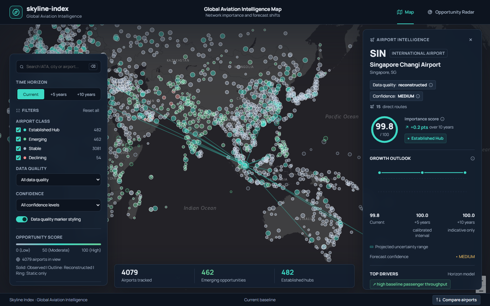

# Skyline Index: Global Aviation Intelligence Map

Skyline Index models the global commercial aviation network and forecasts changes in airport importance over 5-year and 10-year horizons. The project produces an annual importance percentile rank from 0 to 100 for global commercial airports, trains supervised models on historical network topology and macroeconomic shifts, and presents forward forecasts on an interactive map with an unserved route Opportunity Radar.

Scores are percentiles capped at 100 so the top hubs saturate.

The interactive map displays 4,079 active commercial airports with recorded network routes or observed traffic, drawn from 9,051 facilities in the 2000 to 2025 historical panel. Private airstrips, closed facilities, and unserved rural airfields without commercial flights are excluded.

Map demo: https://skyline-index-web.vercel.app/



## Repository Layout

- `data/`: Tracked route topology inputs (`data/inputs/routes.dat`), panel parquets (`data/processed/`), and output artifacts (`data/outputs/` containing forecasts, candidate routes, and models).
- `reports/`: Validation summaries covering temporal folds, baseline comparisons, feature ablations, and probabilistic data reconstruction.
- `scripts/`: Data ingestion and panel preparation pipelines (`01_download.py`, `02_build_panel.py`, and `03_build_model_table.py`).
- `src/`: Modules for airport metadata, network graph metrics, composite importance scoring, feature definitions, and target construction.
- `tests/`: Automated test suite verifying schema contracts, uncertainty bounds, deterministic predictions, and pipeline execution.
- `web/`: Client application with Leaflet map rendering, trajectory filters, route connectivity overlays, and opportunity tables.

## Data Sources

The project combines three primary data sources across 2000 to 2025:
1. Official airport passenger statistics: FAA annual passenger boardings (United States) and Eurostat air transport statistics (Europe).
2. Flight route networks: OpenFlights global route database and OpenSky Network flight movements.
3. National macroeconomic indicators: World Bank annual commercial passenger totals, GDP, population, and tourism arrivals, supplemented with IMF projected GDP growth and UN demographic projections.

## Defining the Importance Index

Airport throughput volume alone fails to reflect network centrality, intercontinental transfer roles, or regional market isolation. A connecting hub with twenty million annual passengers linking regional spokes to international carriers plays a distinct coordination role compared to a domestic origin-destination terminal with identical passenger throughput.

Importance combines three component groups:
1. Network Topology (weight 0.47): PageRank centrality (weight 0.25), betweenness centrality (0.20), total route degree (0.20), flight frequency degree (0.15), direct country reach (0.10), and links to top 50 global hubs (0.10).
2. Passenger Traffic (weight 0.48): Observed passenger counts where available, and probabilistically reconstructed counts elsewhere.
3. Catchment and Market Scale (weight 0.05): Metropolitan anchor population (0.40), national GDP per capita (0.25), international tourism arrivals (0.20), and national GDP (0.15).

Ranks are computed against a fixed reference population across all years to maintain stable percentiles over time. Missing values are carried forward up to 3 years from past observations; future values are never carried backward.

Airports carry data quality labels:
- Observed (1,640 airports): Official passenger statistics from FAA, Eurostat, or OpenSky.
- Reconstructed (2,214 airports): Estimated from national totals with calibrated intervals.
- Static Only (225 airports): Scored from physical runway capacity and route topology alone.

## Probabilistic Reconstruction of Missing Data

Official passenger statistics are published primarily in the United States and Europe. Missing historical traffic and route networks are reconstructed probabilistically:

1. Traffic share model: LightGBM and Ridge models predict each airport's share of national commercial passenger volume using city population, 100 km catchment population, runway lengths, scheduled service flags, OpenSky flight counts, distance to larger hubs, and national GDP per capita. Predicted shares are normalized to sum to the World Bank national total.
2. Traffic validation: Leave-one-country-out validation in 2019 yields log MAE of 1.206 on the United States, 0.751 on Germany, 0.590 on France, 0.769 on the United Kingdom, 0.618 on Spain, and 0.610 on Italy. In regional transfer from Europe to the United States, the model achieves log MAE of 1.224 and Spearman correlation of 0.851, outperforming population-based allocation (log MAE 2.356, Spearman 0.424).
3. Network reconstruction: A gravity link prediction model estimates edge presence using time-varying node masses, great-circle distances, and regional flags, calibrated to match 2014 OpenFlights network density.
4. Network validation: On a 20 percent held-out test graph, the model achieves ROC AUC of 0.983 and Brier loss of 0.0508, with precision at 100 of 1.000. In out-of-time validation on OpenSky 2019 to 2022 route appearances, the model achieves ROC AUC of 0.960 and precision at 100 of 0.420.

## Supervised Models and Validation

Forecasting predicts the change in importance percentile rank over 5 years (2030) and 10 years (2035).

Three supervised models are evaluated on rolling temporal folds:
1. LightGBM Regressor with maximum depth 5 and 31 leaves.
2. Ridge Regression with logarithmic volume transforms.
3. Equal-weight Ensemble averaging LightGBM and Ridge predictions.

Split conformal prediction intervals centered on the ensemble point forecast provide uncertainty bands.

### Headline Results

| Horizon | Fold | Test Year | Model | Test N | Risers P | Risers R | Fallers P | Fallers R | MAE Change | Spearman Level | Calibrated Coverage |
|---|---|---|---|---|---|---|---|---|---|---|---|
| 5 | 1 | 2018 | persistence | 1,479 | 0.088 | 0.088 | 0.054 | 0.054 | 4.538 | 0.9721 | - |
| 5 | 1 | 2018 | linear_trend | 1,479 | 0.155 | 0.155 | 0.088 | 0.088 | 4.948 | 0.9643 | - |
| 5 | 1 | 2018 | ridge | 1,479 | 0.061 | 0.061 | 0.169 | 0.169 | 4.940 | 0.9699 | - |
| 5 | 1 | 2018 | lightgbm | 1,479 | 0.108 | 0.108 | 0.155 | 0.155 | 4.319 | 0.9727 | - |
| 5 | 1 | 2018 | ensemble | 1,479 | 0.074 | 0.074 | 0.176 | 0.176 | 4.542 | 0.9719 | 0.622 |
| 5 | 2 | 2019 | persistence | 1,416 | 0.106 | 0.106 | 0.077 | 0.077 | 3.481 | 0.9851 | - |
| 5 | 2 | 2019 | linear_trend | 1,416 | 0.155 | 0.155 | 0.077 | 0.077 | 7.033 | 0.9732 | - |
| 5 | 2 | 2019 | ridge | 1,416 | 0.261 | 0.261 | 0.218 | 0.218 | 3.326 | 0.9848 | - |
| 5 | 2 | 2019 | lightgbm | 1,416 | 0.394 | 0.394 | 0.261 | 0.261 | 2.824 | 0.9839 | - |
| 5 | 2 | 2019 | ensemble | 1,416 | 0.401 | 0.401 | 0.239 | 0.239 | 2.952 | 0.9850 | 0.895 |
| 5 | 3 (COVID) | 2020 | persistence | 1,322 | 0.098 | 0.098 | 0.060 | 0.060 | 3.871 | 0.9810 | - |
| 5 | 3 (COVID) | 2020 | lightgbm | 1,322 | 0.195 | 0.195 | 0.406 | 0.406 | 3.899 | 0.9809 | - |
| 5 | 3 (COVID) | 2020 | ensemble | 1,322 | 0.218 | 0.218 | 0.391 | 0.391 | 3.867 | 0.9829 | 0.853 |
| 10 | 1 | 2013-2015 | persistence | 4,123 | 0.097 | 0.097 | 0.075 | 0.075 | 5.282 | 0.9576 | - |
| 10 | 1 | 2013-2015 | lightgbm | 4,123 | 0.063 | 0.063 | 0.090 | 0.090 | 11.044 | 0.9357 | - |
| 10 | 1 | 2013-2015 | ensemble | 4,123 | 0.065 | 0.065 | 0.099 | 0.099 | 13.904 | 0.8858 | 0.323 |
| 10 | 1 | 2013-2015 | damped (gamma 0.7) | 4,123 | 0.065 | 0.065 | 0.099 | 0.099 | 10.768 | 0.9202 | - |

Key model behaviors:
- At horizon 5, LightGBM achieves lower change MAE than persistence (4.319 versus 4.538 on Fold 1, and 2.824 versus 3.481 on Fold 2).
- Riser precision at horizon 5 is unstable across folds, measuring 0.074 to 0.108 on Fold 1 before rising to 0.394 to 0.401 on Fold 2.
- At horizon 10, supervised models lose to persistence on change MAE (persistence achieves 5.282, compared to 11.044 for LightGBM and 10.768 for the damped ensemble). Over a decade, multi-year fluctuations mean-revert, and zero predicted change yields lower average error than supervised extrapolation. The damped model is shipped to provide directional signals, but both numbers are documented.
- Fold 1 coverage at horizon 5 reaches 62.2 percent, below the 70 percent target, and is labeled as a rough range. Folds 2 and 3 reach 89.5 percent and 85.3 percent and are labeled as calibrated intervals.
- Measured coverage at horizon 10 reaches 32.3 percent when calibrated on the training slice (target year 2014, earlier than test target years 2023 to 2025), remaining below the 70 percent target. Horizon 10 bands are labeled as indicative only.

Trajectory classification rules:
- Any airport with forecast score 90 or higher is an established hub.
- For airports below 90, emerging and declining classes are assigned to the top and bottom 20 percent of predicted change within each data quality group, provided change is at least 2.0 points and at least 0.5 times the prediction band half-width. Otherwise the airport is stable.
- For airports with present score 95 or higher, +5 and +10 levels are set to the present score plus the +5 change, clipped to 100. The +10 level inherits the +5 level unless the +10 model indicates a larger move beyond its band, bounded below by the +5 level minus the +5 band half-width.

Predicted class shares:
- At +5: stable 0.755, established hub 0.118, emerging 0.113, declining 0.013.
- At +10: stable 0.737, established hub 0.115, emerging 0.110, declining 0.039.

Feature ablation yields a 5-year change MAE of 3.891 with all 46 features, 3.907 without network metrics, 3.608 without macroeconomic drivers, and 3.630 using traffic features alone.

## Opportunity Radar

The Opportunity Radar identifies unserved airport pairs using gravity modeling, Adamic-Adar common neighbor centrality, and endpoint momentum multipliers.

Validation on 2014 route splits with distance and endpoint size matched negatives yields combined ROC AUC of 0.983, with precision at 100 of 1.000 and precision at 500 of 0.994. Out-of-time testing against OpenSky 2019 to 2022 route appearances yields an AUC of 0.960 and a 13.8 percent appearance share among the top 500 candidates (compared to 1.7 percent for random unserved pairs).

The radar exports the top 250 unserved airline route candidates, along with filtered views for investors and tourism boards. All entries represent statistical model candidates rather than confirmed commercial demand.

## Capacity Watch

Capacity Watch evaluates physical airfield bottlenecks by comparing forecast traffic importance against an airport capacity percentile derived from runway count and longest runway length (from OurAirports runway data).

Airports in observed and reconstructed data quality groups with present importance of 30 or higher whose pressure gap (forecast importance level minus capacity percentile) ranks in the top 10 percent of their group are flagged as expansion candidates. Unobserved static airports are excluded.

Regional clusters within 150 km containing at least 2 expansion candidates and lacking any long runway facility (2,500 m or longer with capacity above the 80th percentile) are flagged as new-capacity areas in `data/outputs/capacity_areas.json` (13 identified areas).

Historical backtest results (origin year 2013 to target year 2018):
- Flagged expansion candidates: 351 airports
- Eligible airports: 3,495 airports
- 5-year growth hit rate for flagged candidates: 30.5 percent
- Random baseline hit rate: 41.1 percent
- Persistence baseline hit rate: 41.1 percent
- Empirical lift: 0.74x (labeled as exploratory)

Operational limits:
Airports under acute capacity pressure in 2013 were already operating near runway throughput limits, frequently experiencing growth deceleration or mean reversion unless capital infrastructure projects were completed. Capacity is a runway proxy, model signal, not planning advice.

## Running the Project

All training, evaluation, reconstruction, and forecasting steps execute inside `training_notebook.ipynb`. Parquet inputs are tracked in `data/processed/`, allowing execution from a fresh repository clone without downloading raw source archives.

Run the notebook interactively:

```bash
jupyter notebook training_notebook.ipynb
```

Or execute headlessly from the command line:

```bash
jupyter nbconvert --to notebook --execute --inplace training_notebook.ipynb
```

Execution completes in under 15 minutes with random seed 42 set at the top.

To rebuild the entire pipeline from raw public data files:

```bash
python scripts/01_download.py
python scripts/02_build_panel.py
python scripts/03_build_model_table.py
jupyter nbconvert --to notebook --execute --inplace training_notebook.ipynb
```

Or run the pipeline script:

```bash
python run_all.py
```

## Running the Web Map Locally

To serve the web application locally:

```bash
python -m http.server 8000
```

Open `http://localhost:8000/web/index.html` in a web browser.

Live deployment: https://skyline-index-web.vercel.app/

## Limitations

1. Network topology snapshot: Route edges rely on the 2014 OpenFlights network combined with OpenSky 2019 to 2022 flight logs. Unrecorded routes opened after 2022 are not captured.
2. Reconstructed traffic stability: Within-country traffic distributions remain stable because they are anchored to national passenger totals and physical infrastructure.
3. Long-horizon mean reversion: Supervised models fail to beat persistence over 10 years because multi-year aviation shifts mean-revert.
4. Exogenous events: Models do not anticipate sudden airspace closures, airline restructurings, or geopolitical disruptions.
5. Score saturation: Scores are percentile ranks capped at 100, which compresses differences between the largest megahubs.

## License

This project is licensed under the MIT License. See LICENSE for details.
