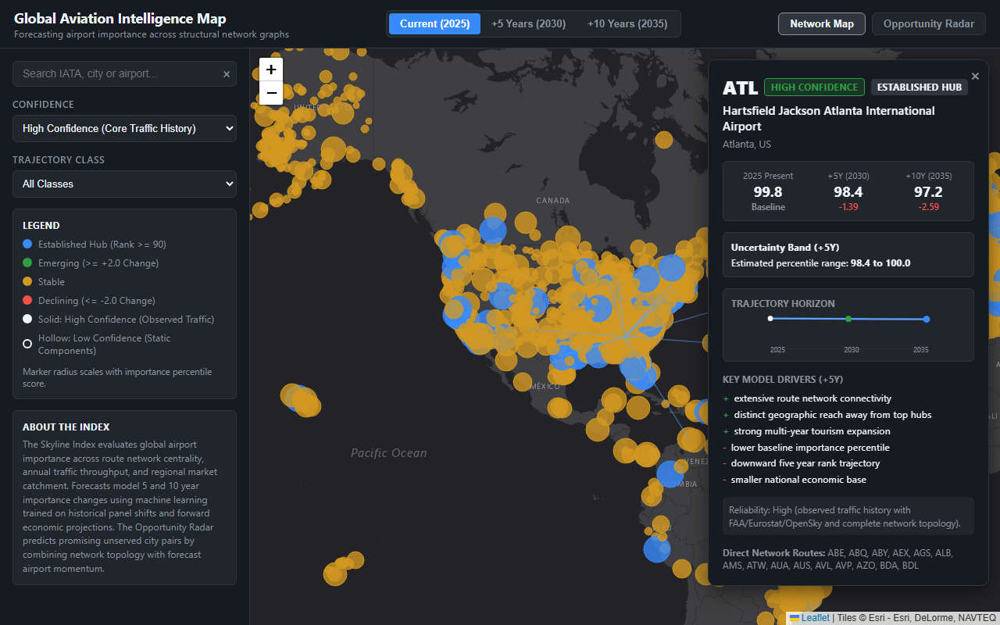

# Skyline Index: Global Aviation Intelligence Map

I built Skyline Index to model the global aviation network and forecast how the relative importance of commercial airports changes over 5-year and 10-year horizons. The project produces an annual importance percentile rank from 0 to 100 for global airports, trains supervised models on historical network and macroeconomic shifts, and presents the resulting forecasts on an interactive dark-canvas web map with an unserved route Opportunity Radar.



## The Problem

Air transport importance is often equated with raw annual passenger volume. While passenger volume measures airport throughput, it fails to capture topological centrality, intercontinental gateway roles, or regional market isolation. A hub that connects forty regional spokes to twelve international flag carriers plays a structural coordination role in the global airline network that volume numbers alone do not reveal.

Furthermore, forecasting airport importance requires historical temporal validation rather than random cross-validation. In this project, I define airport importance as a composite measure that combines route network topology, annual passenger counts, and regional market catchment, evaluate it over a 26-year historical panel from 2000 to 2025, and forecast forward changes for 2030 (+5 years) and 2035 (+10 years).

## Data Sources

I assembled public data from nine open sources without proprietary commercial schedule feeds:

1. OurAirports: 9,051 airports keyed by 3-letter IATA code, providing geographic coordinates, runways, elevation, and municipality metadata.
2. OpenFlights: 67,663 airline route segments connecting 3,388 commercial airports in an undirected graph of 18,809 unique flight edges.
3. OpenSky Network: State-level ADS-B flight lists across 2019 to 2022, capturing flight movement rebounds and route appearances.
4. US Federal Aviation Administration: Annual passenger enplanements from 2004 to 2025 for all commercial service airports in the United States.
5. Eurostat (avia_paoa): Annual passenger totals from 1993 to 2025 for commercial airports across European Union member states and partner nations.
6. World Bank World Development Indicators: Annual country-level air passenger counts, GDP in constant US dollars, GDP per capita, population, and international tourist arrivals.
7. International Monetary Fund World Economic Outlook: Country-level real GDP growth rates and forward economic projections through 2031.
8. United Nations World Population Prospects: Demographic panels and forward population and median age projections through 2100.
9. GeoNames: Global settlement locations with populations exceeding 15,000, used to compute 100-kilometer urban catchment populations and distance to large metropolitan agglomerations.

## Defining Airport Importance

I define airport importance as a weighted composite index computed from three main component groups:

1. Network Topology (weight 0.47): PageRank centrality (weight 0.25), betweenness centrality (0.20), total route degree (0.20), flight frequency degree (0.15), direct country reach (0.10), and links to top 50 global hubs (0.10).
2. Passenger Traffic (weight 0.48): Observed annual passenger throughput from Eurostat, FAA enplanements doubled to reflect two-way passenger flow, or OpenSky annual flight movements.
3. Catchment and Market Scale (weight 0.05): Metropolitan anchor population (0.40), national GDP per capita (0.25), international tourism arrivals (0.20), and national GDP (0.15).

To prevent temporal leakage, I enforce an as-of carry forward rule. Missing values are filled only from past observations at or before year t, with a maximum age limit of 3 years. Future values are never carried backward.

Percentile ranks are calculated against a fixed reference population of 1,621 core airports that possess at least two years of observed passenger traffic alongside network and market data. Scoring non-core airports against this fixed reference set prevents shifting percentile denominators when reporting coverage changes across calendar years. Non-core airports scored from static network and market components alone are explicitly flagged as low confidence.

## Features

For each airport in each year, I compute 36 point-in-time features strictly using data available up to origin year t:

- Network features: total routes, weighted routes, PageRank, betweenness, clustering coefficient, international flight share, direct countries reached, and connections to top 50 global megahubs.
- Spatial and catchment features: distance to nearest city over 1,000,000 residents, anchor city population, 100-kilometer catchment population, distance to nearest larger hub, and distance to nearest top 50 hub.
- Traffic dynamics: passenger volume, 1-year traffic growth, 3-year traffic growth, 5-year traffic growth, and recent OpenSky flight growth.
- Macroeconomic dynamics: national GDP, national population, 1-year, 3-year, and 5-year GDP and population growth rates, 5-year tourism growth, GDP per capita, IMF projected growth, and UN median age.
- Rank momentum: current importance percentile, 1-year momentum, 3-year momentum, and 5-year momentum.

## Models and Targets

I formulate forecasting as predicting the future change in importance percentile rank (target_change_h5 and target_change_h10), then adding that change back to current importance. Direct level models are trained alongside as comparisons.

To guarantee valid training targets, I enforce a target comparability condition: a training row is comparable only if the exact same component sets were observed at origin year t and target year t+h. This eliminates artificial rank changes caused by component appearance or disappearance.

I evaluate three supervised regressors:
1. LightGBM Regressor with trees constrained to depth 5 and 31 leaves.
2. Ridge Regression with median imputation, logarithmic volume transformations, and standard scaling.
3. Equal-weight Ensemble averaging LightGBM and Ridge predictions.

I also fit two quantile LightGBM models at alpha 0.10 and alpha 0.90 to produce uncertainty bands, and a 4-class LightGBM classifier predicting trajectory classes: emerging (change >= +2.0), declining (change <= -2.0), established hub (current rank >= 90 and change >= -1.0), or stable.

## Validation and Mover Results

Validation uses rolling temporal folds matching src/splits.py. Origin years 2000 to 2015 train the models, with COVID target years (2020 to 2022) excluded from loss calculations.

Evaluation focuses on mover metrics: precision and recall on the top 10 percent risers and bottom 10 percent fallers by actual change.

| Horizon | Fold | Test Year | Model | Test N | Risers P | Risers R | Fallers P | Fallers R | MAE Change | Spearman Level | Band Coverage | Macro F1 |
|---|---|---|---|---|---|---|---|---|---|---|---|---|
| 5 | 1 | 2018 | Persistence | 1,553 | 0.122 | 0.122 | 0.058 | 0.058 | 7.213 | 0.8950 | - | - |
| 5 | 1 | 2018 | Linear Trend | 1,553 | 0.032 | 0.032 | 0.006 | 0.006 | 7.243 | 0.8948 | - | - |
| 5 | 1 | 2018 | Ridge | 1,553 | 0.327 | 0.327 | 0.237 | 0.237 | 7.357 | 0.8979 | - | - |
| 5 | 1 | 2018 | LightGBM | 1,553 | 0.308 | 0.308 | 0.051 | 0.051 | 7.008 | 0.9080 | - | - |
| 5 | 1 | 2018 | Ensemble | 1,553 | 0.359 | 0.359 | 0.244 | 0.244 | 7.102 | 0.9036 | 0.387 | 0.376 |
| 5 | 2 | 2019 | Persistence | 1,151 | 0.147 | 0.147 | 0.052 | 0.052 | 5.734 | 0.9166 | - | - |
| 5 | 2 | 2019 | Linear Trend | 1,151 | 0.078 | 0.078 | 0.103 | 0.103 | 5.877 | 0.9162 | - | - |
| 5 | 2 | 2019 | Ridge | 1,151 | 0.345 | 0.345 | 0.198 | 0.198 | 6.177 | 0.9186 | - | - |
| 5 | 2 | 2019 | LightGBM | 1,151 | 0.491 | 0.491 | 0.164 | 0.164 | 5.644 | 0.9426 | - | - |
| 5 | 2 | 2019 | Ensemble | 1,151 | 0.491 | 0.491 | 0.276 | 0.276 | 5.842 | 0.9315 | 0.505 | 0.437 |
| 5 | 3 | 2020 | Persistence | 1,135 | 0.140 | 0.140 | 0.026 | 0.026 | 6.329 | 0.9140 | - | - |
| 5 | 3 | 2020 | Linear Trend | 1,135 | 0.202 | 0.202 | 0.061 | 0.061 | 7.302 | 0.9104 | - | - |
| 5 | 3 | 2020 | Ridge | 1,135 | 0.561 | 0.561 | 0.132 | 0.132 | 6.523 | 0.9224 | - | - |
| 5 | 3 | 2020 | LightGBM | 1,135 | 0.596 | 0.596 | 0.272 | 0.272 | 6.647 | 0.9524 | - | - |
| 5 | 3 | 2020 | Ensemble | 1,135 | 0.596 | 0.596 | 0.167 | 0.167 | 6.509 | 0.9403 | 0.435 | 0.403 |
| 10 | 1 | 2013-2015 | Persistence | 4,571 | 0.124 | 0.124 | 0.052 | 0.052 | 7.461 | 0.8975 | - | - |
| 10 | 1 | 2013-2015 | Linear Trend | 4,571 | 0.044 | 0.044 | 0.033 | 0.033 | 8.652 | 0.8872 | - | - |
| 10 | 1 | 2013-2015 | Ridge | 4,571 | 0.334 | 0.334 | 0.271 | 0.271 | 9.722 | 0.9089 | - | - |
| 10 | 1 | 2013-2015 | LightGBM | 4,571 | 0.345 | 0.345 | 0.266 | 0.266 | 10.168 | 0.9153 | - | - |
| 10 | 1 | 2013-2015 | Ensemble | 4,571 | 0.352 | 0.352 | 0.273 | 0.273 | 9.803 | 0.9185 | 0.370 | 0.446 |

### Where the Model Beats Persistence

On overall Spearman rank on level, persistence achieves high correlations (0.895 to 0.917) simply because global hub status changes slowly over time. However, persistence has near-zero capability to detect movers. Its riser precision is bounded between 0.122 and 0.147, which is no better than random guessing among the top decile.

The supervised ensemble model achieves riser precision between 0.359 and 0.596 across folds. This represents a 2.5x to 4.2x improvement over persistence, correctly identifying hubs experiencing rapid regional expansion.

### Where the Model Struggles

The model struggles with quantile coverage on out-of-time test folds. The 10th and 90th percentile bands cover between 37.0 and 50.5 percent of actual outcomes, well below the nominal 80 percent target. This occurs because multi-year macroeconomic shifts cause non-stationary variance across distinct calendar periods.

Additionally, linear trend extrapolation completely fails in aviation forecasting. Linear trend achieves riser precision between 0.032 and 0.202, suffering higher MAE than persistence because historical short-term growth rates do not extrapolate linearly over multi-year horizons.

## Opportunity Radar

To turn aviation forecasting into actionable network planning, I built an Opportunity Radar that evaluates unserved city pairs. The system combines:

1. A gravity model based on origin and destination importance, great-circle distance, and domestic flags.
2. Topological link prediction computing Adamic-Adar scores and preferential attachment across the route network.
3. Growth acceleration multipliers using the 5-year forecast importance changes of both endpoint airports.

I validated link prediction by hiding 20 percent of existing routes. The validation AUC scores are:
- Gravity Model: 0.983
- Preferential Attachment: 0.870
- Adamic-Adar: 0.938
- Combined Calibrated Model: 0.990

The radar exports the top 250 candidate unserved routes, alongside curated views for investors (top high-confidence risers) and tourism boards (destinations gaining network reach and market). Every list carries a prominent notice stating that results are statistical model candidates rather than confirmed commercial demand.

## Interpretability with SHAP

To make forecasts clear to decision makers, I extract TreeExplainer SHAP values from the LightGBM models and map the top three positive and top three negative contributions per airport into readable phrases:

- "extensive route network connectivity" (high total routes)
- "central node in global airline graph" (high PageRank)
- "fast growing national economy" (strong GDP growth)
- "isolated from competing major hubs" (high distance to larger hubs)
- "close competition from larger rival hubs" (nearby competing megahub)
- "smaller domestic population base" (limited domestic catchment)

## Honest Limitations

1. Old Route Snapshot: The baseline global route topology relies on OpenFlights 2014, layered with OpenSky 2019 to 2022 movements. Modern route expansions from 2023 to 2025 that did not report publicly to open sources are missing from the topology.
2. Reporting Skew: Annual passenger time series are concentrated in the US (FAA) and Europe (Eurostat). While 1,621 airports have high-confidence traffic histories, 7,430 smaller airports are scored primarily on static network and catchment components and flagged as low confidence.
3. Horizon 10 Calendar Overlap: In the 10-year blocked evaluation split, training rows span origin years 2000 to 2004 (target years 2010 to 2014) and test rows span 2013 to 2015 (target years 2023 to 2025). The 26-year panel cannot support non-overlapping 10-year windows with sufficient training samples.
4. Macroeconomic Exogenous Shocks: The model cannot anticipate sudden airline bankruptcies, geopolitical airspace bans, or abrupt regulatory changes that disrupt routes overnight.

## How to Run the Pipeline

Clone the repository and install pinned dependencies:

```bash
git clone https://github.com/park-bit/skyline-index.git
cd skyline-index
pip install -r requirements.txt
```

To run the entire pipeline from scratch, execute:

```bash
python run_all.py
```

Or run each pipeline step individually:

```bash
python scripts/01_download.py
python scripts/02_build_panel.py
python scripts/03_index_sensitivity.py
python scripts/04_build_model_table.py
python scripts/05_evaluate_baselines.py
python scripts/06_make_figures.py
python scripts/07_train_and_evaluate.py
python scripts/08_run_radar.py
pytest -v
```

If make is installed:

```bash
make all
```

## Running the Web Map Locally and Deploying

To run the map interface locally:

```bash
python -m http.server 8000
```

Open `http://localhost:8000/web/index.html` in your browser.

To deploy to Vercel without a build step:
1. Connect the GitHub repository to Vercel.
2. Leave build commands blank.
3. Set the root directory as the project root. The included `vercel.json` automatically routes `/` to `/web/` and `/data/` to `/data/outputs/`.

## Licence

This project is licensed under the MIT License. See LICENSE for details.
